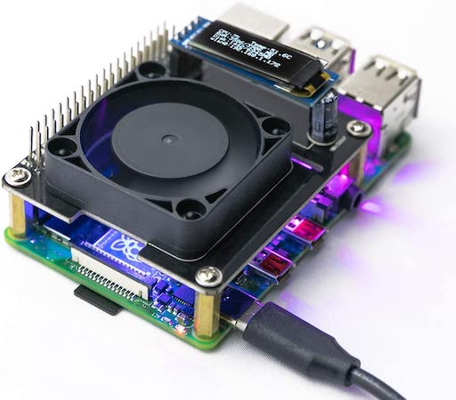

yahboom-raspi-cooling-fan
=========================

Crowd-sourced code for the "Yahboom Raspberry Pi Cooling HAT with
Intelligent Temperature Control": 



Tested on Raspberry Pi OS 32-bit.

How to run the Python code
--------------------------

The code, as written by Yahboom, is for Python 2.

**Install Python 2 Packages**

```bash
sudo pip install Adafruit_BBIO Adafruit-SSD1306
```

**Run one or more of the Python scripts**

For example, if you want the Fan, RGB, and OLED all controlled
by temperature and the Pi's stats, then in three separate terminal
windows, run:

```bash
python fan_temp.py
```

```bash
python rgb_temp.py
```

```bash
python oled.py
```

**Starting a script automatically when booting**

This easiest way I've found so far is to add, e.g., this line
to root's crontab with `sudo crontab -e`:

```
@reboot /usr/bin/python /home/pi/src/yahboom-raspi-cooling-fan/RGB_Cooling_HAT.py
```

See Also
--------

* [Mini OLED info at Adafruit](https://learn.adafruit.com/adafruit-pioled-128x32-mini-oled-for-raspberry-pi/usage)
* [Yahboom's instructions](https://www.yahboom.net/study/RGB_Cooling_HAT)
